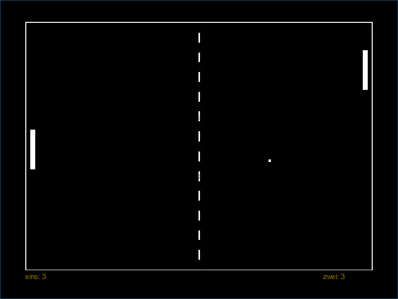

# SWE-Pong
<b><a href="https://github.com/denn-s/swe-pong/releases/download/0.2/Pong-pre_release-0.2.jar">Version 0.2 [pre release]</a></b>

**How to use:**

    java -jar Pong-X.X.jar SpielerNameEins SpielerNameZwei

# Screenshot

**TODO:**
- Fix controll flow
- Fix peddle hitbox
- Fix pause screen
